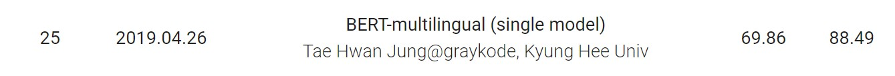
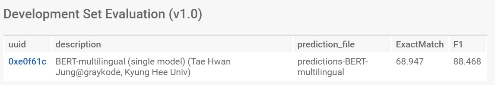

## KorQuAD-beginner

This is a repository for those who are trying [KorQuAD](https://korquad.github.io/) for the first time. I got f1 88.468 and EM(ExactMatch) 68.947, just with the BERT-multilingual(single) model, Only [google-research's BERT github](https://github.com/google-research/bert).



While it was not difficult to achieve results simply by fine-tuning KorQuAD data, using `codalab` was very difficult for the first time. So this repository will also explain in detail how to use `codalab`, how to upload your result to KorQuAD leaderboard.


### 1. fine-tuning KorQuAD

 It is very easy to fine-tuning if you use [google-research's BERT github](https://github.com/google-research/bert). Everything is possible with one line of this command. If you still use Google-research's BERT, Korean subtokens are processed as UNK because of `unicodedata.normalize("NFD", text)`. Please see [here](https://github.com/google-research/bert/pull/228) and pull request [code](https://github.com/google-research/bert/pull/228/commits/c26341272de7c0d22cd65ea58d884323f64b7a92), if you want to more detail. I have already applied Korean Issue in my code. Also I used [**BERT-Base, Multilingual Cased (New, recommended)**](https://storage.googleapis.com/bert_models/2018_11_23/multi_cased_L-12_H-768_A-12.zip) for pre-trained weight(104 languages, 12-layer, 768-hidden, 12-heads, 110M parameters).

```shell
$ python run_squad.py \
  --vocab_file=multi_cased_L-12_H-768_A-12/vocab.txt \
  --bert_config_file=multi_cased_L-12_H-768_A-12/bert_config.json \
  --init_checkpoint=multi_cased_L-12_H-768_A-12/bert_model.ckpt \
  --do_train=True \
  --train_file=config/KorQuAD_v1.0_train.json \
  --do_predict=True \
  --predict_file=config/KorQuAD_v1.0_dev.json \
  --train_batch_size=4 \
  --num_train_epochs=3.0 \
  --max_seq_length=384 \
  --output_dir=./output \
  --do_lower_case=False
```

I tried training the GeForce RTX 2080 and 11GB in memory, and it took about three to four hours.

Then you can evaluate F1 and EM score.

```shell
$ python evaluate-v1.0.py config/KorQuAD_v1.0_dev.json output/predictions.json

{"f1": 88.57661204608746, "exact_match": 69.05091790786284}
```

**Put your checkpoint files in config folder**


### 2. Codalab Guide for submit KorQuAD

##### 0. Sign up in Codalab

Sign up **worksheets**, not completion


##### 1. Install Codalab Cli

The CLI only works with Python 2.7 right now, so if Python 3 is your default, I recommend `Anaconda` configure setting, rather than virtualenv. 

```shell
$ conda create -n py27 python=2.7 anaconda
$ conda activate py27
(py27) $ pip install codalab -U --user
```


##### 2. Create New WorkSheet in Codalab

Click the `New Worksheet` button in the upper right corner and name the worksheet.


##### 3. Test predictions.json that is created on fine-tuning.

> If you don't want to see evaluation of Dev set, Just skip this part.

1. Click `Upload` Button and upload `output/predictions.json` that is created on fine-tuning.

2. In the web interface terminal at the top of the page, type the following command:

   `<name-of-your-uploaded-prediction-bundle>` is uuid[0:8] of `output/predictions.json`.

   ```shell
   # web interface terminal
   cl macro korquad-utils/dev-evaluate-v1.0 <name-of-your-uploaded-prediction-bundle>
   ```

   

##### 4. Upload `src` , `config` folder

The reason for this division is that it takes a long time to upload the config folder (checkpoint files) every time.

- src folder : only source files to run in Codalab, ex) `run_squad.py`
- config folder : `bert_config.json`, `KorQuAD_v1.0_dev.json`,  `KorQuAD_v1.0_dev.json`, `vocab.txt`, `checkpoint files(fine-tuning checkpoint file)`

Upload folders using `Codalab Cli`. You can also upload using the Web UI, but use cli because it's slow for folders.

```shell
# command on Anaconda-Python2.7
# cl upload <folder-name> -n <bundle-name>
$ cl upload Leaderboard -n src
$ cl upload config -n config
```


##### 5. Run learning model for dev set

```shell
# web interface terminal
cl add bundle korquad-data//KorQuAD_v1.0_dev.json .
```

You can see `bundle spec . doesn't match any bundles`, but It's not a problem to proceed.

Then, Run learning model for dev set!

:src, :config meaning of : `<bundle-name>`

```shell
# command on Anaconda-Python2.7
$ cl run :KorQuAD_v1.0_dev.json :src :config "python src/run_KorQuAD.py --bert_config_file=config/bert_config.json --vocab_file=config/vocab.txt --init_checkpoint=config/model.ckpt-45000 --do_predict=True --output_dir=output config/KorQuAD_v1.0_dev.json predictions.json" -n run-predictions --request-docker-image tensorflow/tensorflow:1.12.0-gpu-py3 --request-memory 11g --request-gpus 1
```

###### Trouble shooting

1. About argument : [Original KorQuAD tutorial](https://worksheets.codalab.org/worksheets/0x7b06f2ebd0584748a3a281018e7d19b0/), They recommend python arguments like this.

   ```
   python src/<path-to-prediction-program> <input-data-json-file> <output-prediction-json-path>
   ```

   above command match below: `<bundle-name>`/file-name

   ```
   python src/run_KorQuAD.py --bert_config_file=config/bert_config.json --vocab_file=config/vocab.txt --init_checkpoint=config/model.ckpt-45000 --do_predict=True --output_dir=output config/KorQuAD_v1.0_dev.json predictions.json
   ```

2. About ImportError: libcuda.so.1 error : using `tensorflow 1.12.0` version docker with `python3` and `--request-gpus 1` to clearly specify the pin number.

3. About out of memory : `--request-memory 11g`


##### 6. Add prediction file(result of part 5) in Bundle

Add the prediction file to the bundle.: `MODELNAME` can't contain spaces and special characters.

```shell
# web interface terminal
cl make run-predictions/predictions.json -n predictions-{MODELNAME}
```

Let's see if we can evaluate the prediction file of dev set.

```shell
# web interface terminal
cl macro korquad-utils/dev-evaluate-v1.0 predictions-{MODELNAME}
```


##### 7 Submit(제출)

After this,  To submit your result in leader board, see [Original KorQuAD tutorial](https://worksheets.codalab.org/worksheets/0x7b06f2ebd0584748a3a281018e7d19b0/) of part 3.




## License

These Repository are all released under the same license as the source code (Apache 2.0) with [google-research BERT](https://github.com/google-research/bert), Tae Hwan Jung


## Author

- Tae Hwan Jung(Jeff Jung) @graykode, Kyung Hee Univ CE(Undergraduate).
- Author Email : [nlkey2022@gmail.com](mailto:nlkey2022@gmail.com)
- Reference : [Original KorQuAD tutorial](https://worksheets.codalab.org/worksheets/0x7b06f2ebd0584748a3a281018e7d19b0/), [The Land Of Galaxy Blog](http://mlgalaxy.blogspot.com/2019/02/bert-multilingual-model-korquad-part-2.html#comment-form)